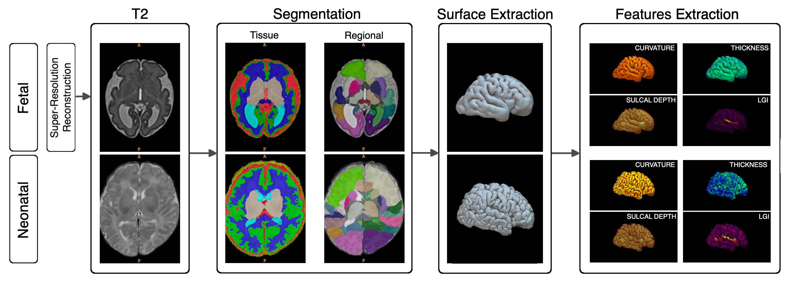

# Perinatal Pipeline



### Developers

**Andrea Urru**: main author.

**Valentin Comte**: contributor.

**Gerard Martí-Juan**: Docker adaptation.

## Running the perinatal pipeline on Ubuntu

To run the perinatal pipeline you will need to download and install the [dHCP pipeline](https://github.com/BioMedIA/dhcp-structural-pipeline).

Once the dHCP pipeline has been installed, you will need to install [ANTs](http://stnava.github.io/ANTs/).

After these steps, you can clone this repository and its content in the dhcp-structural-pipeline folder previously created. After running the setup_perinatal.sh script you will be able to run the pipeline using the following command line:

./perinatal-pipeline.sh <path/to/raw/images> <path/to/demographics/csv/file> <fetneo flag (0 for fetal, 1 for neonatal)> <multisubject altas to use (ANDREA/ALBERT)>

The demorgraphics file should be structured with a first column for the ID, a second column for their gestational age at fetal acquisition (if applicable), and a third column for their gestational age at neonatal acquisition (if applicable).

The raw files should be named fet{ID} or neo{ID}. based on their developmental stage, and put in a directory named after their image type (T2/T1), eg., <path/to/raw/images>/T2/fet037.nii.gz.

## Installing the perinatal pipeline on a Docker container

To install the perinatal pipeline on a Docker container, you will need to install [Docker](https://docs.docker.com/install/).

The latest image can be found in:
[Add link to DockerHub]

### Building the Docker image

Once Docker is installed, you can clone this repository and its content in a folder of your choice. Then, you can build the Docker image using the following command line:

docker build -t perinatal-pipeline .

You can then run the pipeline using the following command line:

```bash
docker run -v <path/to/raw/images>:/data perinatal-pipeline <path/to/raw/images> <path/to/demographics/csv/file> <fetneo flag (0 for fetal, 1 for neonatal)> <multisubject altas to use (ANDREA/ALBERT)>
```

## Known issues
